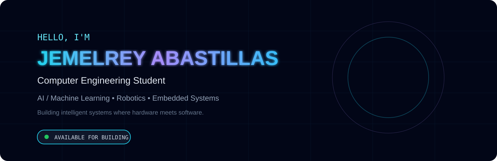
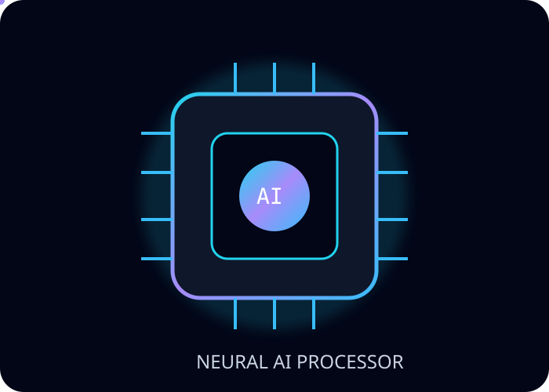

<div align="center">



<br>


</div>

<div align="center">

</div>


<br>


<div align="center">

# JEMELREY ABASTILLAS

### Computer Engineering Student

`Artificial Intelligence` • `Machine Learning` • `Embedded Systems` • `Robotics`

Building intelligent systems where software meets hardware.

</div>


---

<div align="center">

# PROFILE

</div>


<table>
<tr>

<td width="50%" valign="top">


## About Me

I am a Computer Engineering student passionate about developing intelligent systems by combining:

- Artificial Intelligence
- Machine Learning
- Embedded Systems
- Robotics
- IoT
- Backend Engineering


My goal is to become an **AI/ML Engineer specializing in Robotics and Intelligent Systems.**


</td>


<td width="50%" valign="top">


## Current Focus


```yaml
learning:

  Artificial Intelligence:
    - Machine Learning
    - Deep Learning
    - Computer Vision

  Engineering:
    - System Design
    - Backend Architecture
    - Robotics

  Hardware:
    - Embedded AI
    - IoT Systems
    - Microcontrollers
```


</td>

</tr>

</table>


---

<div align="center">

# FEATURED PROJECTS

</div>


<table>

<tr>


<td width="50%" valign="top">


## AI Smoke Detection System


An AI-powered safety monitoring system combining embedded hardware and machine learning.


Architecture:

```
Sensors
   |
ESP32
   |
Machine Learning Model
   |
Prediction
   |
Alert System
```


Technologies:

`ESP32`
`Python`
`Machine Learning`
`GSM`
`IoT`
`Dashboard`


</td>


<td width="50%" valign="top">


## Machine Learning Projects


Developing ML models using real-world datasets.


Focus:

```
Regression

Classification

Feature Engineering

Model Evaluation

Data Analysis
```


Technologies:

`Python`
`NumPy`
`Pandas`
`Scikit-Learn`


</td>


</tr>


<tr>


<td width="50%" valign="top">


## Full Stack Applications


Building scalable applications with modern web technologies.


Stack:

```
Frontend
React

Backend
Node.js / Express

Database
MongoDB
```


</td>


<td width="50%" valign="top">


## Embedded Systems


Hardware projects involving:

```
Microcontrollers

Sensors

Automation

IoT Devices

Robotics
```


Technologies:

`ESP32`
`Arduino`
`C/C++`


</td>


</tr>

</table>


---

<div align="center">

# TECH ARSENAL

</div>


<table>

<tr>

<td width="25%" align="center">


### Languages


</td>


<td width="25%" align="center">


### AI / Data


</td>


<td width="25%" align="center">


### Development


</td>


<td width="25%" align="center">


### Tools


</td>


</tr>

</table>


---

<div align="center">

# ENGINEERING SKILLS

</div>


<table>

<tr>

<td width="50%">


### Artificial Intelligence


```
Machine Learning       █████████░ 90%

Python                 █████████░ 90%

Data Analysis          ████████░░ 80%

Deep Learning          ██████░░░░ 60%

Computer Vision        █████░░░░░ 50%
```


</td>


<td width="50%">


### Software Engineering


```
C / C++                ████████░░ 80%

Backend Development    ████████░░ 80%

Frontend Development   ███████░░░ 70%

Database Design        ██████░░░░ 60%

System Design          █████░░░░░ 50%
```


</td>

</tr>


<tr>


<td>


### Embedded Systems


```
ESP32                  █████████░ 90%

Arduino                █████████░ 90%

IoT                    ████████░░ 80%

Embedded C             ███████░░░ 70%

Robotics               █████░░░░░ 50%
```


</td>


<td>


### Infrastructure


```
Git                    ████████░░ 80%

Docker                 ██████░░░░ 60%

Linux                  ███████░░░ 70%

Cloud                  ████░░░░░░ 40%

CUDA                   ███░░░░░░░ 30%
```


</td>


</tr>

</table>


---

<div align="center">

# SYSTEMS & HARDWARE

</div>


<div align="center">


<br><br>


`ESP32`

`Embedded C`

`Sensors`

`IoT`

`Microcontrollers`

`Automation`


</div>


---

<div align="center">

# GITHUB ANALYTICS

</div>


<div align="center">


<br><br>


</div>


---

<div align="center">

# ROADMAP


```
Machine Learning

        ↓

Deep Learning

        ↓

Computer Vision

        ↓

Robotics

        ↓

AI Engineering
```


</div>


---

<div align="center">

# CONNECT


<a href="https://github.com/jembilog">


</a>


<br><br>


<br><br>


"Building intelligent systems through code, data, and hardware."


</div>
